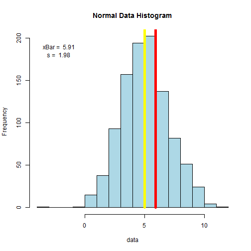

## Sample vs Population
* There are two very common parameters to describe a population: mean and standar deviation
* If you have a data set (sample) taken from the a population, and you want to know the population parameters, its is possible to obtain an estimation of these parameters based on the data set.
* A good estimation for the population mean $\mu$ is the mean of the sample $\bar{x}$, that is calculated as $$\bar{x} = \frac{\sum x_i}{n}$$
* In the same form, a good estimation for the population standar deviation $\sigma$ is the sample standar deviation $s$, that is calculated as $$s = \sqrt{\frac{\sum (x_i - \bar{x})}{n-1}}$$

--- .class #id 

## Sample Size and functions in R

* The estimators will be better if the sample size is bigger.
* The bigger the size of the sample, the better the population parameters are estimated by the sample parameters.
* In R, there is a function called $mean$ to calculate the sample mean. For a data set contained in $X$ its format is:

```
mean(X)
```

* There is a function called $sd$ to calculate the standar deviation. For a data set contained in $X$ its format is:

```
sd(X)
```

--- 

## App instructions and an example

My shiny interactive app allows the user to select values for the size data set generated, population mean, and population standar deviation. It is possible to select size of the subsample set (as a percentaje of the original sample, wich is selected with a slider. that shows an example for a normal population. The steeps to generate the sample are:

1. Generate a set of n = 1000 data from a normal population with mean and standar deviation 2.
2. Plot an histogram with this data.
3. Plot a yellow line indicating the population mean.
4. Select a subsample of m = 1% of the original sample data (it means 10 data).
5. Calculate the subasample mean and standar deviation.
4. Plot a red line indicating the subsample mean.  

It is possible to observe that when the percentage is increased the sample mean (red line) is closest to the population mean (yellow line). The sample mean and standar deviation are showed in upper left corner of the plot.

---

## Code of the example

The code for the example is:

```
n = 1000; mu = 5; sigma = 2
nNumbers <- rnorm(n, mu, sigma)
hist(nNumbers, xlab='data', col='lightblue',main='Normal Data Histogram')
percentage <- 1
samp <- sample(nNumbers, round(percentage*n/100))
xBar <- mean(samp)
s <- sd(samp)
minDataX <- min(nNumbers)+1
maxDataY <- n*.19
lines(c(mu, mu), c(0, 2000),col="yellow",lwd=5)
lines(c(xBar, xBar), c(0, 2000),col="red",lwd=5)   
text(minDataX, maxDataY, paste("xBar = ", round(xBar,2)))
text(minDataX, maxDataY*0.95, paste("s = ", round(s,2)))
```

---

## Graph of the example

The result graph of the example, without interacction (the shiny app is interctive) is:




